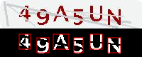
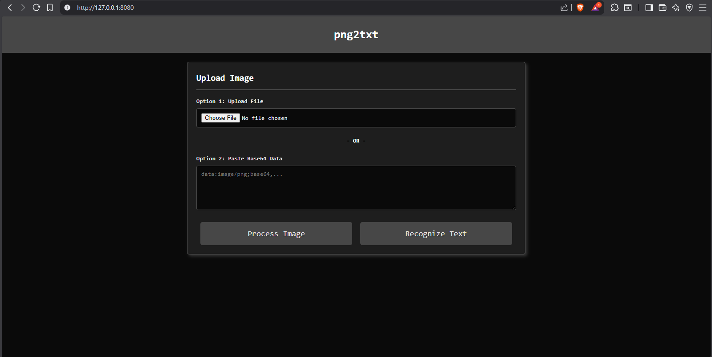

# **png2txt**

<div class="rowholder">
    <style>
        .rowholder {
            display: flex;
            flex-direction: row;
            margin-bottom: 2vh;
            margin-top: 2vh;
        }
        .rowimg {
            height: 50px;
            margin-left: 10px;
        }
    </style>
    
    
    
    
    
    
</div>

This is a simple project I made to solve very basic text-based captchas on a particular website that I frequent.

It uses tensorflow's KNN classification model to train and detect a character from an input image.<br> 
> More about the KNN algorithm:
> - [Wikipedia](https://en.wikipedia.org/wiki/K-nearest_neighbors_algorithm)
> - [GeeksForGeeks](https://www.geeksforgeeks.org/machine-learning/k-nearest-neighbours/)

The image input is first pre-processed, which includes
- Identifying pixel values of the blue channel (out of rgba) that are below a set threshold, setting all the channels of that pixel to 255 and otherwise setting all channels of that pixel to 0
- Identifying positions of characters in the image and returning the bounds and imageData of those specific parts of the image, in order.

> *Sample result of the pre-processing.<br> The top image is the input image and the botom image is the processed image.*<br>
> 

The result is then passed on to the classifier that predicts the characters one by one to finally predict text that is present in the image.

# Tools & Technologies Used

## **Backend**
- [NodeJS](https://nodejs.org/)
- [TypeScript](https://www.typescriptlang.org/)
- [Express](https://expressjs.com/)
- [Tensorflow.js](https://www.tensorflow.org/js) + [KNN Classifier](https://www.npmjs.com/package/@tensorflow-models/knn-classifier)
- [Canvas](https://www.npmjs.com/package/canvas)
    - This is the main part of the project. It includes the KNN classification model, image pre-processing code and the HTTP server with Express to serve the website and the API.
    - The API has two routes:
        - GET `/api/`
            - This returns 
            ```json
            {"error": false}
            ```
        - POST `/api/predict`
            - Headers: `Content-Type: application/x-www-form-urlencoded`
            - Body: URL encoded search params with keys `image` and `b64data`. `image` should be set to `true` if only pre-processed image result is needed. `b64data` is the base64-encoded image data.
            - This returns: 
            ```json
            {
                "error": false, 
                "helpImage": <Base64-encoded image data of pre-processing result>,
                "prediction": <Prediction result>
            }
            ```

## **Frontend**
- Vanilla HTML/CSS, JS
    - A simple website that allows users to select an image or paste base64-encoded image data. There are two buttons that perform the following actions:
        - Recognize Text: This performs an API request to process the image and predict the text present in the image. It returns both the processed image and the predicted text.
        - Process Image: As the name suggests, this performs an API request to only process the image and return the result.
    - The website makes it easier to view and debug results.

> *Demo Screenshot of the webpage:*



# Running the project
- Step 1: Ensure you have NodeJS and npm installed on your system.
- Step 2: Clone this repository, cd into it.
- Step 3: Run the following command to install all dependencies.
```
npm i
```
- Step 4: Make a folder named **samples** in the project root directory and inside it add as much as possible, simple captcha puzzle images with their names as the text which is present on them. eg. `ABCDE.jpg` which is a captcha puzzle with text `ACBDE` in it. More images equals better accuracy.
- Step 5: Run the following command to train and start the express server.
```
npm start
```
- The following commands are further available:
    - `npm run train`
        - This trains the classifier and saves it in a directory named **train_results** in the project's root directory with the filename as the [current epoch timestamp](https://www.unixtimestamp.com/) (result of JavaScript's `Date.now()`).
           > **Important**: This command REQUIRES labelled images to be present inside the **samples** folder in the project's root directory as instructed by Step 4.
    - `npm run prod`
        - This does not train the classifier and instead only runs the express server (API, website). The latest model available inside the folder **models** in the project's root directory is loaded.
            > **Important**: This command REQUIRES a model to be manually copied from the **train_results** folder to the **models** folder in the project's root directory incase the **models** folder has no models present, unless the command will fail to execute.

# Project structure
```md
png2txt/
├── .gitignore
├── models/ (trained models)
├── samples/ (training data)
├── package.json
├── public/ (static website frontend)
│   ├── index.css
│   ├── index.html
│   └── index.js
├── README.md
├── src/ (backend code)
│   ├── imageProcessing.ts (pre-processing of the image)
│   ├── knn.ts (tensorflow classification code)
│   ├── main.ts  (main code, controls flow of the program)
│   └── train.ts (controls processing and training)
└── tsconfig.json
```

# Contributing
- Pull requests are more than welcome!
- If you face an error, kindly open an issue under the issues tab with proper description and (if found), the fix. 
- Feature requests & Suggestions can also be made using the issues tab.